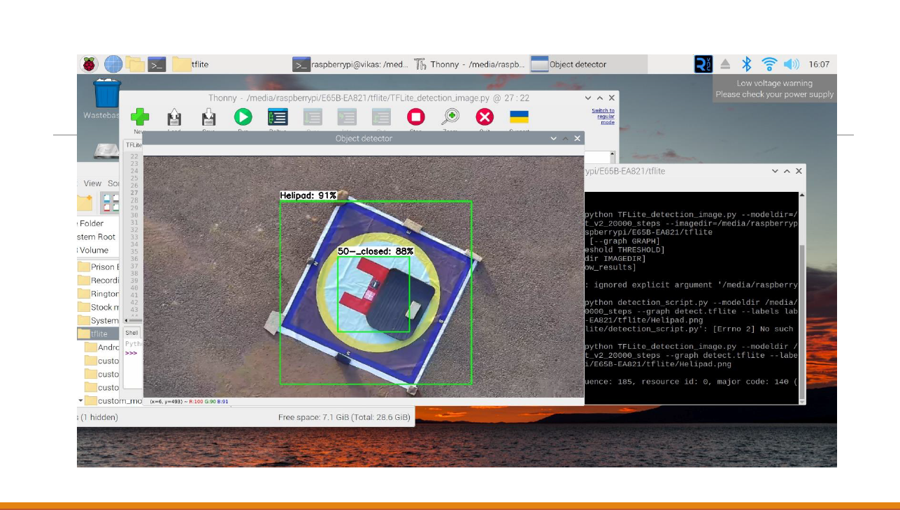

# Helipad Detection and Alignment with Deep Learning

## Project Overview
This project focuses on developing an advanced system for helipad detection and precise alignment using cutting-edge computer vision and deep learning techniques. The project involved the training and deployment of a sophisticated model for helipad recognition, followed by an innovative alignment system for automated drone landing and charging operations. The primary goal was to ensure accurate and reliable detection and alignment of helipads, enabling seamless autonomous operations.

## Data Collection
- Drone Video Data: Collected drone video data at heights of 5 and 10 meters, capturing helipads from various angles and perspectives to create a diverse and comprehensive dataset.
- Helipad Dimensions: Recorded helipad dimensions, including the square shape, the distinctive red "H" marking within a 165cm x 165cm box, and other crucial physical attributes.
- Additional Features: Developed a series of 9 switches, including positive and negative switches, as well as multiple switches serving different purposes, to enhance the functionality and versatility of the system.

## Model Training and Testing
- SSDMobileNet v2 FPNLite 320: Trained the model for 20,000 steps with a batch size of 16, achieving exceptional mean Average Precision (mAP) performance, ensuring accurate and efficient helipad detection from the collected drone video data.
- EfficientDet D0: Utilized the EfficientDet D0 model, trained for 10,000 steps on the Google Colab platform. Although the model exhibited slightly lower mAP compared to the SSDMobileNet v2 FPNLite 320, it was optimized for deployment on resource-constrained devices, ensuring its effectiveness and performance in real-world scenarios.
- Data Augmentation: Implemented advanced data augmentation techniques to increase the labeled data from 346 images to 1027 images, significantly enhancing the diversity and quantity of the dataset, thereby improving the overall robustness and reliability of the models.

## Results and Challenges
- Successful Helipad Detection: Successfully demonstrated the accurate detection of helipads in the 10-meter video captured using the Raspberry Pi. The system exhibited robust performance and reliable detection capabilities, ensuring precise alignment for autonomous drone landing and charging operations.
- Identified Challenges: Addressed various factors contributing to the lower performance observed in the EfficientDet D0 model, enabling a comprehensive understanding of the system's limitations and potential areas for improvement.

## Model Conversion and Deployment
- TensorFlow Lite (TFLite) Conversion: Transformed the trained model into a lightweight format compatible with resource-constrained devices, ensuring seamless and efficient deployment of the model in real-world scenarios.
- Raspberry Pi Deployment: Leveraged the Raspberry Pi for the deployment of the trained model, allowing for the practical implementation and testing of the system in a real-world environment. Conducted comprehensive assessments to evaluate the system's real-time performance and validate its effectiveness in autonomous drone landing and charging operations.

